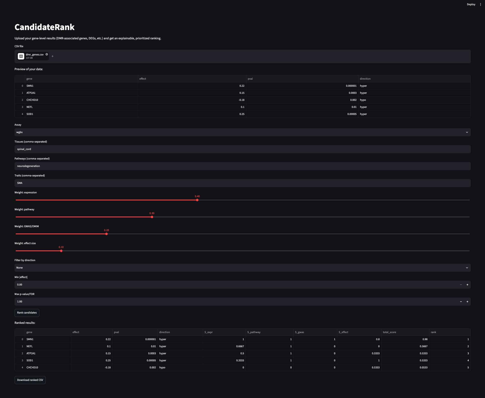

# CandidateRank

**CandidateRank** is an explainable candidate-gene prioritization tool for omics studies.

It helps researchers move from large lists of DMR-associated genes, differentially
expressed genes, or future gene-level variant summaries to a smaller, transparent
shortlist of candidates for biological follow-up.



## Why CandidateRank?

Omics analyses often generate hundreds or thousands of statistically associated
genes. Statistical significance alone does not answer the practical question:

> Which genes should I investigate first?

CandidateRank combines evidence from the uploaded result table with selected
biological context to produce an interpretable ranking. It is designed to make
candidate prioritization more systematic, customizable, and auditable.

The project was motivated by the challenge of prioritizing candidate genes from
a WGBS study of spinal muscular atrophy (SMA), but it is being developed as a
general tool for multiple omics result types.

## What it does

CandidateRank currently supports:

- Uploading a CSV containing gene-level omics results
- Ranking genes using a configurable weighted score
- Filtering results by:
  - Direction, such as hypermethylated or hypomethylated
  - Minimum absolute effect size
  - Maximum p-value or FDR
- Combining four evidence sources:
  - Expression in selected tissues
  - Pathway membership
  - Curated disease or trait evidence
  - Effect size from the uploaded results
- Explaining why a selected candidate ranked highly
- Showing the weighted contribution of each evidence source
- Downloading the ranked table as CSV
- Running through a Python CLI or local Streamlit web interface

## Important limitation

CandidateRank is an **evidence-prioritization tool**, not a causal-inference or
clinical-decision tool. A high ranking does not prove that a gene causes a
phenotype or should be experimentally validated without reviewing the study
design, underlying data, relevant literature, and biological context.

The current release uses small toy reference datasets for development. Real,
versioned data sources for tissue expression, pathways, and disease evidence
will be added in later versions.

## Quick start

### Local development setup

Clone the repository:

```bash
git clone https://github.com/munaberhe/candidaterank.git
cd candidaterank
```

Create and activate a virtual environment:

```bash
python3 -m venv .venv
source .venv/bin/activate
```

Install CandidateRank in editable mode with web dependencies:

```bash
pip install -e ".[web]"
```

Run the Streamlit application:

```bash
streamlit run web/frontend/app.py
```

Then open the local URL shown in your terminal, usually:

```text
http://localhost:8501
```

## Example input

CandidateRank expects a CSV with at least these columns:

| Column | Required | Description |
|---|---:|---|
| `gene` | Yes | Gene symbol or identifier |
| `effect` | Yes | Numeric effect size, such as Δmethylation or log2 fold change |
| `pval` | Yes | P-value or FDR |
| `direction` | No | Direction such as `hyper`, `hypo`, `up`, or `down` |

Example:

```csv
gene,effect,pval,direction
SMN1,0.22,0.000001,hyper
ATP2A1,0.15,0.0003,hyper
CHCHD10,-0.18,0.002,hypo
NEFL,0.10,0.01,hyper
SOD1,0.25,0.00005,hyper
```

An example file is included at:

```text
examples/dmr_genes.csv
```

## Web workflow

1. Upload a gene-level CSV file.
2. Select an assay type, such as WGBS or RNA-seq.
3. Specify biological context:
   - Relevant tissue(s)
   - Pathway(s)
   - Disease or trait(s)
4. Adjust evidence weights.
5. Optionally filter by direction, effect size, and p-value/FDR.
6. Click **Rank candidates**.
7. Review the ranked table and select a gene to inspect its score breakdown.
8. Download the ranked results as CSV.

## CLI usage

Rank genes from an example WGBS-associated gene table:

```bash
candidaterank rank \
  examples/dmr_genes.csv \
  ranked_genes.csv \
  --assay wgbs \
  --tissues spinal_cord \
  --pathways neurodegeneration \
  --traits SMA \
  --weights expr=0.4,pathway=0.3,gwas=0.2,effect=0.1 \
  --filter-direction hyper \
  --filter-min-abs-effect 0.1 \
  --filter-max-pval 0.01
```

## Scoring model

For each gene, CandidateRank calculates normalized component scores from 0 to 1:

- \(S_{\mathrm{expr}}\): expression evidence in selected tissue(s)
- \(S_{\mathrm{pathway}}\): membership in selected pathway(s)
- \(S_{\mathrm{disease}}\): curated disease or trait evidence
- \(S_{\mathrm{effect}}\): relative absolute effect size in the uploaded input

The final priority score is:

\[
\mathrm{PriorityScore} =
w_{\mathrm{expr}}S_{\mathrm{expr}} +
w_{\mathrm{pathway}}S_{\mathrm{pathway}} +
w_{\mathrm{disease}}S_{\mathrm{disease}} +
w_{\mathrm{effect}}S_{\mathrm{effect}}
\]

User-provided weights are normalized internally before calculating the final score.

## Project structure

```text
candidaterank/
├── candidaterank/          # Core Python package
│   ├── cli.py              # Command-line interface
│   ├── data_loaders.py     # Reference-data loaders
│   ├── filters.py          # Input filtering logic
│   └── scoring.py          # Ranking and scoring engine
├── data/                   # Future versioned reference datasets
├── docs/
│   └── images/             # Documentation images and screenshots
├── examples/               # Example input files
├── tests/                  # Automated tests
├── web/
│   └── frontend/
│       └── app.py          # Streamlit interface
├── pyproject.toml          # Package configuration
└── README.md
```

## Roadmap

### Current MVP

- [x] Python package structure
- [x] Configurable CLI ranking workflow
- [x] Direction, effect-size, and p-value/FDR filters
- [x] Transparent weighted scoring
- [x] Streamlit web interface
- [x] Candidate-level score explanations
- [x] CSV export
- [x] Example WGBS input data

### Planned improvements

- [ ] Real, versioned tissue-expression reference data
- [ ] Real pathway and disease-evidence resources
- [ ] User-uploaded custom gene sets
- [ ] Support for TSV input
- [ ] Better gene-ID normalization and Ensembl support
- [ ] Assay-specific scoring profiles for WGBS, RNA-seq, and variants
- [ ] More robust automated test coverage
- [ ] Dockerized deployment validation
- [ ] Optional FastAPI backend and saved analysis sessions

## Development

Run the test suite:

```bash
pytest tests
```

Run the Streamlit app:

```bash
streamlit run web/frontend/app.py
```

## License

This project is currently under active development. An MIT license will be added before the first public release.
